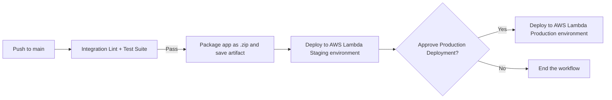

# 03_04 Continuous Deployment for Lambda Functions

This lesson extends our existing Python integration workflow into a complete CI/CD pipeline that automatically deploys an application to Amazon Web Services using AWS Lambda.

## Integration (CI)

- Reuses the existing integration workflow
- Lints the code and runs the test suite
- Must succeed before delivery or deployment can run

## Delivery

- Adds a delivery job to the pipeline
- Packages the application into a ZIP archive
- Publishes the ZIP as a workflow artifact

## Deployment

- Adds a deployment job that consumes the artifact
- Deploys the application to AWS Lambda
- Build and deploy steps remain clearly separated

## Environments

- **Staging**: Automatically deploys on every successful push to `main`
- **Production**: Requires manual approval enforced using environment protection rules

## References

| Reference | Description |
|----------|-------------|
| [Lambda Project Details](./LAMBDA_PROJECT_DETAILS.md) | Documentation for the Lambda project used in this lesson |

## Lab: Continuous Deployment to AWS Lambda with GitHub Actions

In this lab, you’ll complete a full CI/CD pipeline that deploys a Python application to **AWS Lambda** using **GitHub Actions**.

You’ll reuse an existing integration workflow, package the application as an artifact, and deploy it automatically to a staging environment with an approval gate for production.

### Prerequisites

Before starting this lab, you should have:

- Completed the previous lesson and have the **exercise files**
- An **AWS account** with a CloudFormation stack already deployed
- A **GitHub repository** where you can configure variables and workflows

### Step 1: Verify Lambda Environments

Using the resources created earlier in the course, confirm that two Lambda environments exist:

- **Staging Lambda function**
- **Production Lambda function**

At this point, both functions are placeholders and do not yet contain the application code. These functions will be updated by the deployment workflow later in the lab.

### Step 2: Configure Repository Variables

Confirm your repository so workflows can authenticate with **Amazon Web Services**.

> [!TIP]
> If your repository is not already configured to authenticate with AWS, please complete the previous lesson.

1. Open your GitHub repository settings.
2. Select **Secrets and variables** then select **Actions**.
3. Select the **Variables** tab.
4. Confirm that **Production** and **Staging** environments variables are in place for:

   - `FUNCTION_NAME`
   - `URL`

5. Confirm that **Repository variables** are in place for:

   - `AWS_REGION`
   - `AWS_ROLE_ARN`

These values will be referenced by GitHub Actions during deployment.

### Step 3: Upload Exercise Files and Workflows

1. Upload the application code from the exercise files into the repository.
2. Move the workflow files into the `.github/workflows` directory.

> [!IMPORTANT]
> Move the **integration workflow first**.  This prevents the deployment workflow from triggering and failing due to a missing dependency.

### Step 4: Review the Integration Workflow

Open the integration workflow file.  This workflow is responsible for linting and testing the application.

Note the characteristics:

- Includes a `workflow_call` trigger for reuse
- Includes a `push` trigger that **ignores the `main` branch**

Why this matters:

- Prevents the integration workflow from running twice on pushes to `main`
- Avoids duplicate runs when called by the deployment workflow

### Step 5: Review the Deployment Workflow

Open the deployment workflow file and note the key sections:

| Section | Description |
|---------|-------------|
| **Concurrency configuration** | Ensures only one deployment runs at a time |
| **Integration job** | Calls the integration workflow to reuse linting and testing logic |
| **Artifact packaging** | Packages the application code and uploads a ZIP file as a workflow artifact |
| **Staging deployment job** | Automatically deploys after integration succeeds |
| **Production deployment job** | Requires manual approval; uses the same artifact created earlier |

Both deployment jobs:

- Configure AWS credentials using the service account
- Download the artifact
- Deploy the application to AWS Lambda

### Step 6: Run the Deployment Workflow

1. Open the **Actions** tab in your repository.
2. Select the deployment workflow.
3. Choose **Run workflow** to start a new run.

Observe the workflow as it:

- Runs integration
- Packages the application
- Deploys automatically to **Staging**

### Step 7: Verify the Staging Deployment

Once the workflow reaches the production approval step:

1. Open the staging environment.
2. Reload the page to confirm the new version is live.
3. Perform any validation or testing needed to confirm the deployment is successful.

This is the quality checkpoint before production deployment.

### Step 8: Approve and Deploy to Production

1. Return to the workflow run.
2. Select **Review deployments**.
3. Check the box next to **Production**.
4. Add a comment (for example: *Looks good to me!*). 😎
5. Select **Approve and deploy**.

Wait for the production job to complete.

### Step 9: Confirm Production Deployment

Once the workflow finishes:

- Verify that the production Lambda function has been updated successfully
- Confirm the application is running as expected

## Lab Complete

After completing the steps for this lab, you should have in place:

- Continuous deployment to **Staging**
- A protected deployment to **Production**
- Artifact-based delivery using GitHub Actions
- Environment-level approval gates

> [!TIP]
> If you’re following along, update the code and push changes to your repository to see the continuous deployment behavior in action.  Maybe even push some bad code to see how the workflow responds to failures.

<!-- FooterStart -->
---
[← 03_03 Create a Service account for Deployments](../03_03_service_account/README.md) | [03_05 Continuous Deployment for Infrastructure as Code →](../03_05_cd_for_iac/README.md)
<!-- FooterEnd -->
